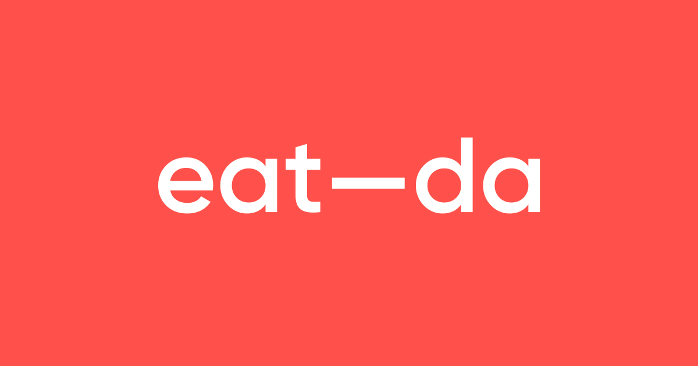

# 잇다 (Eat-da)

> 우리 동네 주부님의 집밥, 정성 가득 집밥 한 끼

<!-- 프로젝트 대표 이미지/배너 -->



<div align="center">

### [🍚배포 링크🍚](https://eat-da.vercel.app/)

---


</div>

<br>

## 목차

1. [프로젝트 소개](#프로젝트-소개)
2. [팀원 소개](#팀원-소개)
3. [주요 기능](#주요-기능)
4. [페이지 구조 & 흐름도](#페이지-구조--흐름도)
5. [시연 영상](#시연-영상)
6. [회고](#회고)

<br>

## 프로젝트 소개

**잇다**는 주부의 손맛을 수익으로 전환하고, 자취생에게는 신뢰할 수 있는 집밥을 제공하는 동네 기반 반찬 플랫폼입니다. '동네 픽업'을 통해 같은 지역의 주부와 자취생을 연결하며, 단순한 상품 거래를 넘어 신뢰 기반의 관계를 만드는 것을 목표로 합니다.

### 잇다의 핵심 특징

1. **동네 기반 픽업** - 배달이 아닌 같은 동네 공유주방에서 직접 픽업하는 신뢰할 수 있는 집밥 경험
2. **티어 시스템** - 판매량을 기반으로 주부를 1단부터 9단까지 시각화하여 신뢰도를 직관적으로 표현
3. **손맛 중심 구조** - 공장이 아닌 주부가 직접 만든 정성 가득한 반찬을 판매하는 신뢰 기반 서비스

<br>

## 팀원 소개

<table>
  <tr>
    <td align="center"></td>
    <td align="center"></td>
    <td align="center"></td>
    <td align="center"></td>
  </tr>
  <tr>
    <td align="center" width="200"><a href="https://github.com/jiyou228">김지유</a></td>
    <td align="center" width="200"><a href="https://github.com/zinapark">박지은</a></td>
    <td align="center" width="200"><a href="https://github.com/nnjys99">장유석</a></td>
    <td align="center" width="200"><a href="https://github.com/UJin1122">이유진</a></td>
  </tr>
  <tr>
    <td align="center">PM</td>
    <td align="center">PL & 디자인 총괄</td>
    <td align="center">발표</td>
    <td align="center">서기</td>
  </tr>
  <tr>
    <td>
    <details>
      <summary><b>홈</b></summary>
      <sub>• 추천 주부</sub><br>
      <sub>• 추천 반찬</sub>
    </details>
    <details>
      <summary><b>장바구니</b></summary>
      <sub>• 바텀 시트 구현</sub><br>
      <sub>• 헤더 장바구니 수량 플로팅 처리</sub>
    </details>
    <details>
      <summary><b>구매</b></summary>
      <sub>• 구매 페이지</sub><br>
      <sub>• 구매완료 페이지</sub><br>
      <sub>• 실결제 연동</sub>
    </details>
    <details>
    <summary><b>위시리스트</b></summary>
      <sub>• 찜 목록 관리</sub>
    </details>
    <details>
      <summary><b>검색</b></summary>
      <sub>• 상품 검색</sub>
    </details>
    </td>
    <td>
    <details><summary><b>주부 목록·상세</b></summary><sub>내용</sub></details>
    <details><summary><b>반찬 목록·상세</b></summary><sub>내용</sub></details>
    <details><summary><b>About</b></summary><sub>내용</sub></details>
    </td>
    <td>
    <details><summary><b>로그인</b></summary><sub>• 로그인 페이지</sub></details>
    <details>
      <summary><b>회원가입</b></summary>
      <sub>• 다음 주소 API 연동</sub><br>
      <sub>• DiceBear 아바타 생성 API 연동</sub>
    </details>
    <details>
      <summary><b>리뷰</b></summary>
      <sub>• 리뷰 관리 페이지</sub><br>
      <sub>• 리뷰 작성 · 수정</sub>
    </details>
    <details><summary><b>개인정보 설정</b></summary><sub>• 개인 정보 수정 페이지</sub><br>
    <sub>• 정보 확인 페이지</sub></details>
    <details><summary><b>헤더</b></summary><sub>• 공통 헤더 컴포넌트</sub></details>
    </td>
    <td>
    <details>
      <summary><b>마이페이지</b></summary>
      <sub>• 사용자 티어 기능 추가 및 페이지 반영</sub>
    </details>
    <details>
      <summary><b>반찬 관리</b></summary>
      <sub>• 판매자 전용 페이지</sub><br>
      <sub>• 반찬 등록 · 수정 · 삭제</sub><br>
      <sub>• 픽업 장소 선택- 카카오맵 연동</sub>
    </details>
    <details>
      <summary><b>구매 내역</b></summary>
      <sub>• 구매 목록 페이지</sub><br>
      <sub>• 구매 상세 페이지-주문 상태 표시</sub>
    </details>
    <details>
      <summary><b>주문 관리</b></summary>
      <sub>• 판매자 전용 페이지</sub><br>
      <sub>• 주문 상태 변경 기능</sub>
    </details>
    <details>
      <summary><b>알림</b></summary>
      <sub>• 토스트 알림 컴포넌트 구현</sub><br>
      <sub>• 알림 페이지</sub><br>
      <sub>• 홈 헤더 알림 수 표시</sub><br>
      <sub>• 주문 알림</sub><br>
      <sub>• 픽업 리마인더 알림</sub><br>
      <sub>• 픽업 확인 알림</sub>
    </details>
    <details>
      <summary><b>채널톡</b></summary>
      <sub>• 고객센터 및 홈 채널톡 연동</sub>
    </details>
    </td>
  </tr>
</table>

<br>

## 개발 기간 : 2026.01.14 ~ 2026.02.12 (30일)

<br>

## 주요 기능

### 구매자

| 기능                  | 설명                                 |
| --------------------- | ------------------------------------ |
| **회원가입 / 로그인** | 이메일 기반 회원가입 및 로그인       |
| **홈 / 상품 탐색**    | 추천 상품, 카테고리별 반찬 탐색      |
| **검색**              | 상품 및 판매자 검색                  |
| **상품 상세**         | 상품 정보, 리뷰 확인                 |
| **장바구니**          | 상품 담기, 수량 변경                 |
| **주문 / 결제**       | PortOne 결제, 구독 결제              |
| **픽업 알림**         | 주문 상태 변경 시 실시간 토스트 알림 |
| **찜하기**            | 관심 상품 저장                       |
| **리뷰 작성**         | 구매 후 리뷰 작성                    |
| **마이페이지**        | 주문 내역, 구독 관리, 알림 센터      |

### 판매자

| 기능               | 설명                                          |
| ------------------ | --------------------------------------------- |
| **반찬 등록/수정** | 상품 CRUD 관리                                |
| **주문 관리**      | 실시간 주문 알림 (WebSocket), 주문 상태 변경  |
| **알림 센터**      | 주문 알림 목록 확인 및 읽음 처리              |
| **티어 시스템**    | 리뷰와 판매량 기반 주부 신뢰도 시각화 (1~9단) |

<br>

## 페이지 구조 & 흐름도


```
app/
├── (user)/                     # 인증
│   ├── login/                  # 로그인
│   └── signup/                 # 회원가입
├── home/                       # 홈
├── products/                   # 상품 목록 / 상세
├── search/                     # 검색
├── sellers/                    # 판매자 목록 / 상세 / 구독
├── cart/                       # 장바구니
├── checkout/                   # 주문 / 결제
│   ├── complete/               # 결제 완료
│   └── subscribe/              # 구독 결제
├── account/                    # 계정 관리
├── mypage/                     # 마이페이지
│   ├── banchan/                # 반찬 관리 (판매자)
│   ├── orders/                 # 주문 관리 (판매자)
│   ├── purchases/              # 구매 내역
│   ├── subscription/           # 구독 관리
│   ├── notifications/          # 알림 센터
│   ├── map/                    # 공유주방 지도
│   ├── verify/                 # 본인 인증
│   └── support/                # 고객 지원
├── wishlist/                   # 찜 목록
├── review/                     # 리뷰 관리 / 작성 / 수정
└── about/                      # 소개
```

<br>

## 시연 영상

### 1. 홈 화면

**스플래시 이미지** → **홈**

<video src="https://github.com/user-attachments/assets/e1699f4a-4a6f-4b71-b833-20758cc216a5" width="800" autoplay loop muted></video>

앱 진입 시 보이는 메인 화면으로, 오늘의 추천 반찬과 주부님을 한눈에 탐색할 수 있습니다.

---

### 2. 위시리스트

**홈/반찬 목록/상품 상세** → **위시리스트**

<video src="https://github.com/user-attachments/assets/d61fe49a-b68b-4b13-acf3-d6c8e76b8de4" width="800" autoplay loop muted></video>

홈이나 상품 페이지에서 마음에 드는 반찬의 하트 버튼을 클릭해 찜하고, 위시리스트에서 찜한 반찬을 한눈에 확인하며 언제든지 주문할 수 있습니다.

---

### 3. 반찬 둘러보기

**홈** → **반찬 목록** → **필터/정렬/검색** → **상품 상세**

<video src="https://github.com/user-attachments/assets/d2edddd5-5dfd-49ff-9985-887f25b0c9f4" width="800" autoplay loop muted></video>

현재 위치한 동네 공유주방 기준으로 반찬이 노출되며, 카테고리 필터·정렬·검색 기능으로 원하는 반찬을 빠르게 찾을 수 있습니다. 상세 페이지에서는 이미지, 가격, 재료, 픽업 정보와 리뷰를 확인할 수 있습니다.

---

### 4. 반찬 주문

**상품 상세** → **장바구니 담기** → **장바구니** → **주문하기** → **결제 완료**
<br>

**상품 상세** → **바로 구매** → **결제 완료**

<video src="https://github.com/user-attachments/assets/64f261a4-5692-4493-8ac2-183a24308ab0" width="800" autoplay loop muted></video>

상품 상세에서 장바구니에 담은 뒤 수량을 조절하고 주문하거나, 바로 구매를 통해 즉시 결제할 수 있습니다. 픽업 날짜와 시간을 선택한 후 PortOne 결제로 안전하게 주문을 완료합니다.

---

### 5. 판매자 반찬 관리

**마이페이지** → **반찬 관리** → **반찬 등록/수정/삭제**

<video src="https://github.com/user-attachments/assets/8e8e7564-accc-49c1-9a17-750852033311" width="800" autoplay loop muted></video>

판매자가 마이페이지의 '반찬 관리'에서 새로운 반찬을 등록하고, 이름·가격·설명 등을 수정하며, 본인 주소 기준 가까운 공유주방 핀을 설정할 수 있습니다.

---

### 6. 판매자 주문 알림

**구매자 주문** → **실시간 주문 알림** → **알림 센터**

<video src="https://github.com/user-attachments/assets/d6289b26-050c-4484-8e7a-cd2461b08bea" width="800" autoplay loop muted></video>

구매자가 주문하면 판매자에게 WebSocket으로 실시간 토스트 알림이 전달됩니다. 알림 센터에서 읽지 않은 알림을 확인하고, 알림 클릭 시 해당 주문 관리 페이지로 바로 이동할 수 있습니다.

---

### 7. 판매자 주문 관리

**마이페이지** → **주문 관리** → **상태 변경**

<video src="https://github.com/user-attachments/assets/85a4e56c-c08c-490c-aaac-2f793a0dd741" width="800" autoplay loop muted></video>

판매자가 '주문 관리'에서 상태별 필터링으로 주문을 확인하고, 대기중 → 승인됨 → 조리완료 → 픽업완료 순서로 주문 상태를 변경하여 픽업을 관리합니다.

---

### 8. 구매 내역

**마이페이지** → **구매 내역** → **주문 상세** → **픽업 상태 확인**

<video src="https://github.com/user-attachments/assets/9db05e49-f9b1-46c0-8b19-3d84e75641ce" width="800" autoplay loop muted></video>

구매자가 마이페이지의 '구매 내역'에서 날짜별로 주문 내역을 확인하고, 주문 상세에서 주문번호·픽업 장소·픽업 시간·결제 금액을 조회할 수 있습니다. 픽업 완료 시 리뷰 작성 버튼이 활성화됩니다.

---

### 9. 리뷰 작성

**픽업 완료** → **리뷰 관리** → **리뷰 작성/수정/삭제**

<video src="https://github.com/user-attachments/assets/916533bb-0d55-46b0-87d8-956f875fd0e1" width="800" autoplay loop muted></video>

리뷰 관리 페이지에서 '작성 가능한 리뷰'와 '내 리뷰' 탭으로 구분되며, 픽업 완료된 상품에 대해 별점·사진(최대 5장)·후기를 작성할 수 있습니다. 작성된 리뷰는 수정·삭제가 가능합니다.

---

### 10. 구독 서비스

**주부 목록** → **주부 상세** → **구독 결제**
<br>
**마이페이지** → **구독 관리**

<video src="https://github.com/user-attachments/assets/49b9345f-5606-4568-b14f-a1956628368d" width="800" autoplay loop muted></video>

**주부 목록**에서 우리 동네에서 정성껏 집밥을 만드시는 주부님들을 만나 구독 상품을 확인한 뒤, 안전한 결제로 구독을 신청하고 **구독 관리**에서 구독 현황을 관리할 수 있습니다.

## 프로젝트 후기

### 😏솔직히 이건 진짜 좋았다

- 각자 잘하는 부분을 적극적으로 맡고, 스스로 할 일을 찾아 책임감 있게 수행하는 팀원들을 만나서 좋았습니다. 어려운 문제가 생기면 함께 고민하고 해결하려는 태도도 인상적이었습니다.매일 데일리 스크럼을 진행하면서 서로의 의견을 존중해주었고, 갑작스럽게 새로운 기능을 제안해도 부정적으로 반응하기보다 “도전해보겠다”는 자세로 임해주어서 팀 분위기가 매우 좋았습니다.덕분에 즐겁고 긍정적인 분위기 속에서 프로젝트를 마무리할 수 있었습니다.

- 제가 실력이 부족해서 맡은 부분이 적었습니다. 그럼에도 불구하고 배려해주시고 계속해서 도움을 주시는 팀원분들을 만나서 좋았습니다. 팀원분들이 다재다능하셔서 제가 걱정했던 것이 무색할 정도였습니다. 본인의 맡은 일을 끝내시고 다른 일을 도와주시기 위해 항상 물어보시고, 제가 검토하지 못한 부분의 오류도 발견하여 말씀해주시니 정말 감사했습니다. 또한 항상 웃는 좋은 분위기를 만들어주셔서 질문을 하거나 실수를 하더라도 주눅들지 않고 마무리할 수 있었던 것 같습니다.

<br>

### 회고

#### 김지유

> 쇼핑몰 CRUD를 전반적으로 잘 활용한 프로젝트였고, 끝까지 완성도 있게 마무리할 수 있어서 뿌듯합니다!

**아쉬운점**

- 날씨 API를 활용해 날씨에 맞는 반찬을 추천하는 기능을 구현하고 싶었지만 적용하지 못한 점
- 실제로 정기결제(구독) 기능이 지원되지 않는 점

**트러블 슈팅**

1. 모바일 결제 시 리다이렉트를 설정하지 않아 결제 완료 후에도 결제화면으로 돌아오는 문제
   → 결제 완료 페이지로 리다이렉트하도록 설정하여 해결
2. 비로그인 상태에서 찜 클릭 시 콘솔에만 에러가 발생하고 사용자에게 피드백이 없는 문제
   → 비로그인 시 로그인 페이지로 이동 후 자동으로 위시리스트 페이지로 이동하며 찜 처리되도록 개선

---

#### 박지은

> -

**아쉬운점**

-

**트러블 슈팅**

-

---

#### 장유석

> 파이널 프로젝트가 걱정이 많이 되었지만 좋은 팀원분들을 만난 덕분에 잘 마무리할 수 있게 되어서 좋았습니다.

**아쉬운점**

- 탈퇴 기능이 없어서 영원히 탈퇴가 불가능하다는 점

**트러블 슈팅**

1. 프로필 이미지를 삭제하거나 없는 상태로 등록했을 때 랜덤 아바타가 표시되지 않는 문제
   → 이미지 URL이 http로 시작하면 전부 무시하는 로직이 원인이었는데, http 여부가 아닌 dicebear(기본 랜덤 이미지) 포함 여부로 구분하도록 변경하여 해결

---

#### 이유진

> 처음 다뤄보는 기술이 많아 도전적이었지만, 팀원들과 함께여서 완성할 수 있었습니다.

**아쉬운점**

- 주문 상태 변경에 따른 단계별 알림 기능을 추가하지 못한 점
- 판매자와 구매자 간 실시간 채팅 기능을 구현하지 못한 점
- Service Worker를 활용한 백그라운드 푸시 알림을 적용해보고 싶었지만 도입하지 못한 점

**트러블 슈팅**

1. Socket.IO가 채팅 기반 구조라 알림 용도로 사용했을 때 판매자가 본인 주문을 넣으면 자기 자신에게도 토스트 알림이 출력되는 문제
   → 주문을 보내는 동안에는 본인에게 알림이 뜨지 않도록 플래그를 추가하고, 각 판매자마다 별도의 소켓 방을 만들어 주문받은 판매자에게만 알림이 가도록 수정
2. 픽업 리마인더 알림을 WebSocket으로 구현하려 했으나, 소켓에 예약 알림 기능이 없어 시간 기반 알림이 불가능했던 문제
   → PickupAlarmProvider를 루트 layout에 배치하여 어떤 페이지에서든 접속만 하면 자동으로 구매 내역을 조회하고, `setTimeout`으로 픽업 1시간 전 리마인더와 픽업 시간 도래 알림을 스케줄링하는 방식으로 전환.
